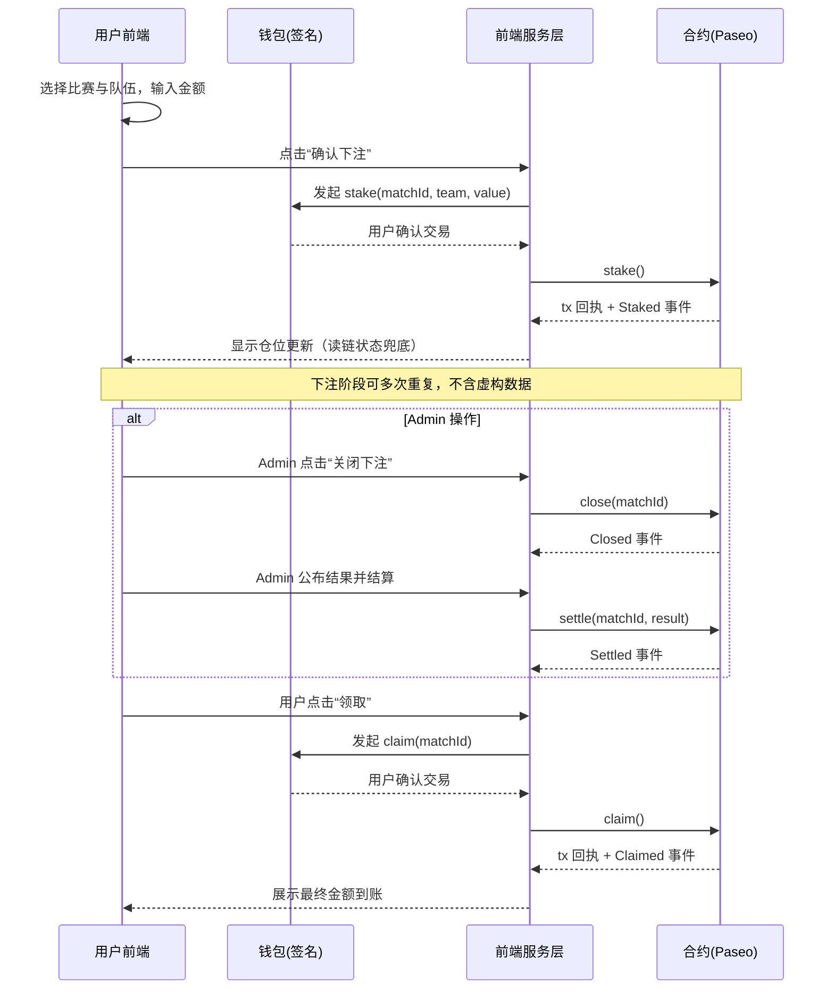

ParaGoal Mermaid 图（架构 / 时序 / 用户路径）

说明

- 本文档将功能模块架构图、核心时序图、用户路径图合并在同一文件中，便于评审与演示。
- 全文不包含任何虚构或示例数据，仅表达结构与流程，具体数据以实际实现与链上状态为准。

功能模块架构图

```mermaid
%% 功能模块架构图 / Functional Module Architecture
%% 目的：展示前端、Web3 接入层与合约侧的模块划分与依赖关系
%% 原则：不包含任何假数据；仅为静态结构；节点为职责而非实现细节
graph TB
  subgraph 前端 React + Tailwind
    UI[页面与组件层\nHome/Match/Admin/Wallet]
    State[状态管理\n账户/网络/比赛/下注/奖池]
    Services[服务层\n合约读写/格式化/错误处理]
    Router[路由\n/ /match/:id /admin]
  end

  subgraph Web3 接入
    Wallet[钱包适配\nEVM兼容]
    RPC[RPC 提供者\nPaseo]
  end

  subgraph 智能合约 Solidity@Paseo
    MatchMgr[比赛管理\n创建/开启/关闭/结算]
    Pool[奖池管理\n注入/总额/手续费归集]
    Stake[下注与结算\n个人仓位/比例计算/领取]
    Events[事件\nCreated/Staked/Closed/Settled/Claimed]
    Storage[存储\nMatch/Stake/累计权重]
  end

  UI --> Router
  UI --> State
  State --> Services
  Services --> Wallet
  Services --> RPC
  Services --> MatchMgr
  Services --> Pool
  Services --> Stake
  Stake --> Events
  MatchMgr --> Events
  Pool --> Events
  Storage -. 读取 .- Services
```

核心时序图（下注 → 结算 → 领取）



用户路径图（从首页到领取）

```mermaid
%% 用户路径 / User Journey
%% 目的：展示从首页进入、管理、下注到最终领取的页面流转
%% 说明：路径为可能流程集合，非强制顺序；无示例数据
flowchart LR
  A[首页: 连接钱包] --> B{右下角显示 Admin?}
  B -- 任意已连接钱包 --> C[进入 Admin 管理台]
  B -- 普通用户 --> D[浏览比赛卡片\n四场固定 + 动态]
  C --> E[创建队伍/比赛]
  E --> D
  D --> F[进入对战页 /match/:id]
  F --> G[选择队伍与金额 → 下注]
  F --> H[Admin 注入奖池]
  G --> I[多次下注(可选)]
  H --> J[关闭下注]
  J --> K[公布结果并结算]
  K --> L[显示可领取金额]
  L --> M[点击领取 → 成功到账]
  F --> N[模拟分析按钮 → 展示静态规则文案]
```


